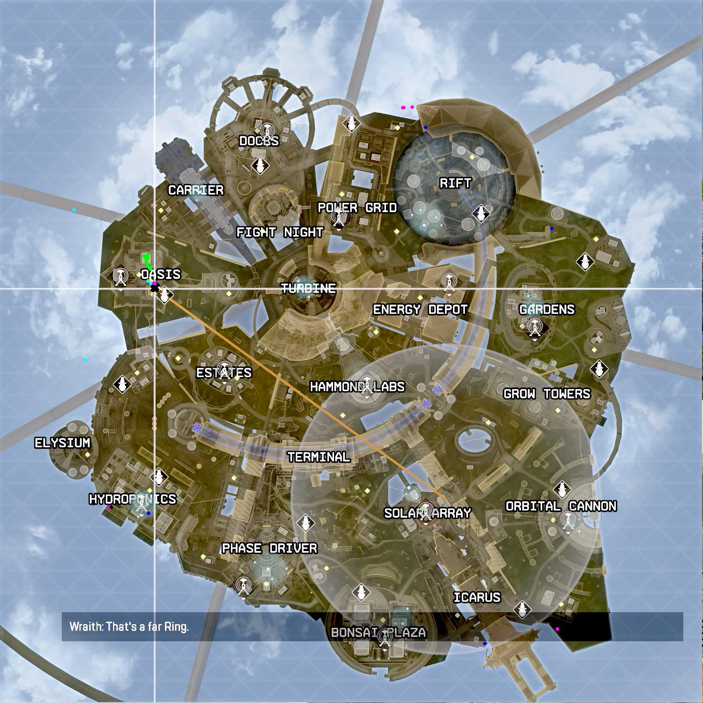

# About

A client-side tool for tracking your movement in the map.

## Build

The usual `go build .`

## Usage

Simply call `./apex-cartographer -f "[your video file path here]" --gui --save --debug`

> NOTE: The built executable does not ship with the maps yet, so they must be in the same location as the structure of the project at the moment.

Only `olympus` is supported for now.
